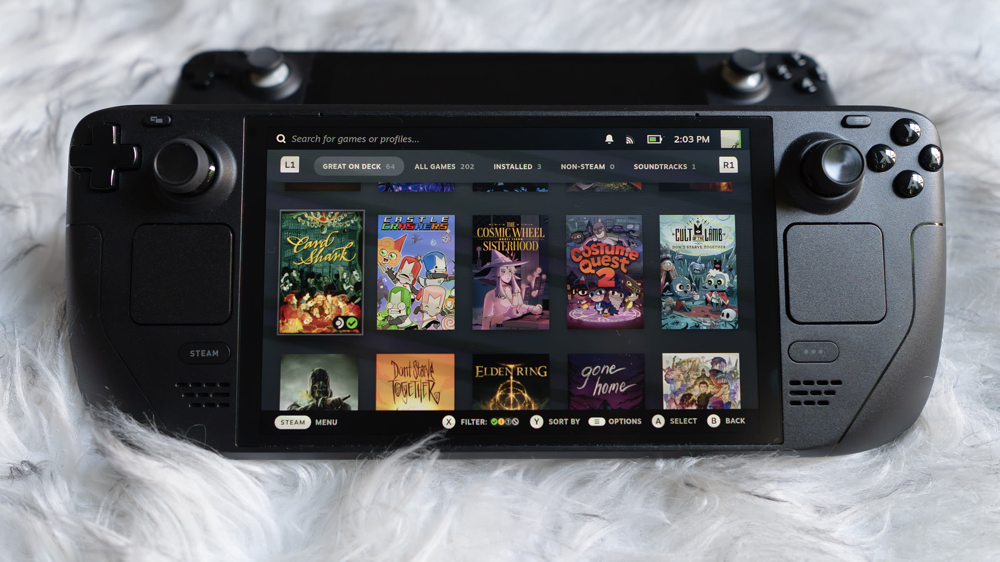
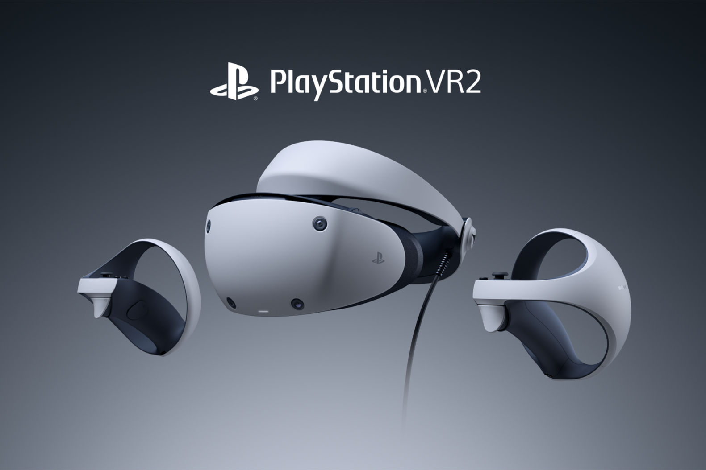
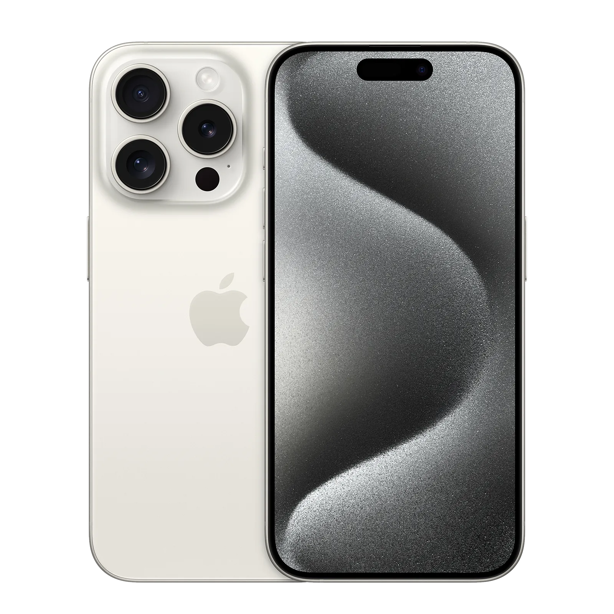

# The Tech of 2023
## Valve - Steam Deck OLED

- Steam Deck's HDR OLED display is designed from the ground up for gaming with striking contrast, brilliant clarity, and a larger picture. With more colors, pure blacks, and amazing motion rendition, you'll see your games in a new light.
- It uses OLED technology to show a much more vivid picture that can get way brighter (600 nits in standard dynamic range, and 1,000 nits peak when used with HDR games, up from a peak of 400 nits on the old LCD) as well as way darker, since pixels on OLED screens can fully turn off, making for inky-black blacks.

## Playstation - Psvr2

- Use your PS VR2 headset as a personal cinema screen for your PlayStation®5 games and entertainment, giving you an incredible sense of scale, and freeing up your TV to be used independently of your console, or switched off entirely.
- The PS VR2 has dual OLED panel with a 4K display resolution and 90 Hz/120 Hz frame rate. Each display has a resolution of 2,000 x 2,040 pixels. The display also supports HDR. The headset uses fresnel lenses.

## Apple - Iphone 15

- The innovative new design features back glass that has color infused throughout the material. A custom dual ion-exchange process for the glass, and an aerospace-grade aluminum enclosure, help make iPhone 15 incredibly durable. Dependably durable.
- iPhone 15 Technical Specifications. The iPhone 15 display has rounded corners that follow a beautiful curved design, and these corners are within a standard rectangle. When measured as a standard rectangular shape, the screen is 6.12 inches diagonally (actual viewable area is less).

